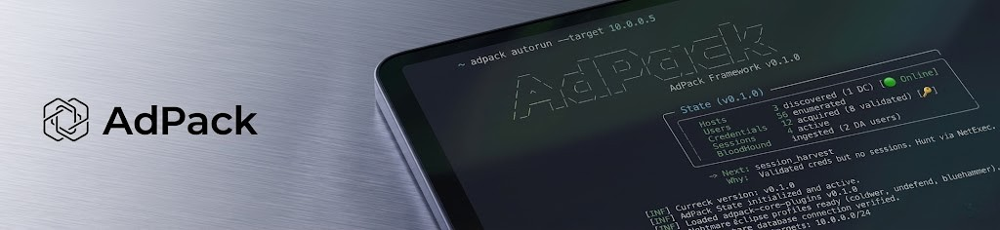

<p align="center">
  
</p>

<h3 align="center">State-aware Active Directory attack orchestration</h3>

<p align="center">
  <a href="LICENSE">
    
  </a>
  <a href="https://go.dev">
    
  </a>
  
  <a href="https://github.com/Yenn503/AdPack/releases">
    
  </a>
</p>

<p align="center">
  <a href="#-quick-start"></a>
  <a href="#-features"></a>
  <a href="#-evasion-profiles"></a>
  <a href="#-documentation"></a>
  <a href="#-installation"></a>
</p>

<br>

> [!IMPORTANT]
> **Authorised Use Only** — This tool is designed for legitimate security assessments and penetration testing with explicit written authorisation. Unauthorised access to computer systems is illegal.

<br>

## ⚫ Overview

adpack runs AD attacks through 9 phases. Tracks hosts, users, creds, and sessions in SQLite. Detects gaps, suggests next steps, and goes from recon to domain admin.

### ⚪ Capabilities

- **Smart Phase Tracking** — Detects missing data and suggests what to run next
- **9 Evasion Profiles** — Includes Nightmare Eclipse zero-days
- **Multi-Protocol Validation** — Tests creds across SMB, LDAP, WinRM, RDP
- **Persistent State** — SQLite survives crashes and resumes sessions
- **One-Command Setup** — `./setup.sh` installs everything

---

## Quick Start

```bash
# Clone and install
git clone https://github.com/Yenn503/adpack.git
cd adpack && ./setup.sh && source ~/.bashrc

# Automated attack chain
adpack autorun --target 10.0.0.5 --max 5
```

### Manual Workflow

```bash
adpack status                          # View current state
adpack run discovery -t 10.0.0.5       # Discover domain controllers
adpack run enumeration -t 10.0.0.5     # Enumerate users and computers
adpack run credential_acq -t 10.0.0.5  # Extract credentials
adpack validate                        # Test credentials across protocols
adpack run lateral -t 10.0.0.6         # Lateral movement
```

<details>
<summary>⚪ View Example Output</summary>

```
  State
───────

╭────────────────────────────────────────────────────────────╮
│   Hosts        3 discovered (1 DC)                         │
│   Users        56 enumerated                               │
│   Credentials  12 acquired (8 validated)                   │
│   Sessions     4 active                                    │
│   BloodHound   ingested (2 DA users)                       │
╰────────────────────────────────────────────────────────────╯

  → Next:  session_harvest
    Why:   Validated creds but no sessions. Hunt via NetExec.
```

</details>

---

## ⚪ Features

### Intel & Orchestration
- Tracks state and detects missing data
- Scores evidence quality
- Skips phases when DA creds found
- TUI dashboard and JSON export

### Credential Operations
- LSASS dumping with multiple evasion techniques
- Kerberoasting and AS-REP roasting
- Multi-protocol validation (SMB, LDAP, WinRM, RDP)
- Detects admin rights and checks if lateral movement works

### Evasion 
- 9 profiles from basic to zero-day
- Nightmare Eclipse exploits (BlueHammer, UnDefend)
- BYOVD kernel access and EDR freezing
- In-memory execution via Donut and BOF

### Automation
- Auto-run with depth limit
- BloodHound integration
- Evidence tracking with timestamps
- Colour-coded CLI output

---

## ⚫ Attack Phases

9 phases from recon to persistence:

<div align="center">

<table>
<tr>
<td align="center"><strong>01. Discovery</strong><br><sub>Find domain controllers and network topology</sub></td>
<td align="center">→</td>
<td align="center"><strong>02. Enumeration</strong><br><sub>Collect users, computers, groups via LDAP</sub></td>
<td align="center">→</td>
<td align="center"><strong>03. Credential Acquisition</strong><br><sub>Extract creds using selected evasion profile</sub></td>
</tr>
<tr>
<td colspan="5" align="center">↓</td>
</tr>
<tr>
<td align="center"><strong>04. Validation</strong><br><sub>Test creds across SMB, LDAP, WinRM, RDP</sub></td>
<td align="center">→</td>
<td align="center"><strong>05. Session Harvesting</strong><br><sub>Find active user sessions on domain systems</sub></td>
<td align="center">→</td>
<td align="center"><strong>06. Graph Analysis</strong><br><sub>Map attack paths with BloodHound</sub></td>
</tr>
<tr>
<td colspan="5" align="center">↓</td>
</tr>
<tr>
<td align="center"><strong>07. Lateral Movement</strong><br><sub>Move between systems using validated creds</sub></td>
<td align="center">→</td>
<td align="center"><strong>08. Privilege Escalation</strong><br><sub>Exploit ACLs, ADCS, RBCD, GPP misconfigs</sub></td>
<td align="center">→</td>
<td align="center"><strong>09. Persistence</strong><br><sub>Golden Ticket, DSRM, long-term access</sub></td>
</tr>
</table>

</div>

---

## ⚪ Evasion Profiles

9 profiles from basic to zero-day:

| Profile | Technique | Detection Risk | Use Case |
|---------|-----------|:--------------:|----------|
| `minimal` | Donut + go-mimikatz | 🟡 Medium | Lab environments |
| `standard` | Donut + go-mimikatz (remote) | 🟡 Medium | Enterprise with Defender |
| `aggressive` | BOF + nanodump | 🟢 Low | C2 integration |
| `fork` | nanodump --fork | 🟢 Low | LSASS process cloning |
| `byovd` | RTCore64.sys | 🟢 Very Low | Kernel-level PPL bypass |
| `coldwer` | EDR-Freeze | 🟢 Very Low | EDR blind spot |
| `undefend` | UnDefend | 🟢 Low | Defender termination |
| `bluehammer` | CVE-2026-33825 | 🟢 Very Low | Unprivileged SAM dump |

### ⚫ Nightmare Eclipse Integration

Uses techniques from the **Nightmare Eclipse leaks** (disclosed Q1 2026):

#### ⚡ BlueHammer (CVE-2026-33825)
Defender RPC bug. Dumps SAM without admin rights via VSS snapshots. No LSASS alerts.

#### ⚪ UnDefend
Kills Defender via service dependency exploit. Bypasses tamper protection.

#### ⚫ ColdWer
WerFaultSecure PPL bypass. Freezes EDR processes during dump. EDR can't see it.

**Example:**

```bash
adpack run credential_acq -e bluehammer -t 10.0.0.5  # ⚡ Exploit Defender RPC
adpack run credential_acq -e coldwer -t 10.0.0.5     # ⚫ Freeze EDR + dump LSASS
adpack validate                                       # ✅ Validate creds
adpack run lateral -t 10.0.0.6                       # ⚪ Lateral movement
```

---

## ⚫ Installation

### Automated Setup

```bash
git clone https://github.com/Yenn503/AdPack.git
cd adpack
./setup.sh
source ~/.bashrc
```

<table>
<tr>
<td><strong>Installs</strong></td>
<td>Go 1.25+, NetExec, Donut, go-mimikatz, pypykatz, ScareCrow, nanodump, adpack binary, default config</td>
</tr>
<tr>
<td><strong>Time</strong></td>
<td>~5-10 minutes</td>
</tr>
</table>

### ⚪ Manual Installation

See [SETUP.md](SETUP.md) for manual install.

---

## ⚫ Configuration

Create `~/.adpack/config.yaml`:

```yaml
db_path: "~/.adpack/state.db"

target:
  domain: "corp.local"
  dc_ip: "10.0.0.5"

evasion:
  default_profile: "standard"
  command_timeout: 120
```

See [config.example.yaml](config.example.yaml) for all available options.

---

## ⚪ Testing Environments

<table>
<tr>
<th width="50%">⚫ VulnAD (Docker)</th>
<th width="50%">⚪ GOAD (Vagrant)</th>
</tr>
<tr>
<td>

```bash
docker run -d \
  -p 389:389 \
  -p 445:445 \
  vulnerables/vulnad

adpack autorun \
  --target 127.0.0.1
```

</td>
<td>

```bash
git clone \
  https://github.com/Orange-Cyberdefense/GOAD

cd GOAD && vagrant up

adpack autorun \
  --target <dc_ip>
```

</td>
</tr>
</table>

---

## ⚫ Documentation

<table>
<tr>
<td width="25%"><a href="USAGE.md"><strong>USAGE.md</strong></a></td>
<td>Complete command reference, workflows, and examples</td>
</tr>
<tr>
<td><a href="SETUP.md"><strong>SETUP.md</strong></a></td>
<td>Installation guide and environment setup</td>
</tr>
<tr>
<td><a href="CONTEXT.md"><strong>CONTEXT.md</strong></a></td>
<td>Domain language, architecture, and design decisions</td>
</tr>
<tr>
<td><a href="CONTRIBUTING.md"><strong>CONTRIBUTING.md</strong></a></td>
<td>Development guidelines and contribution process</td>
</tr>
</table>

---

<div align="center">

## ⚪ License

MIT License - see [LICENSE](LICENSE)

## ⚫ Contributing

PRs welcome. Read [CONTRIBUTING.md](CONTRIBUTING.md) first.

---


<br>

<a href="https://github.com/Yenn503/AdPack/issues"></a>
<a href="https://github.com/Yenn503/AdPack/issues"></a>
<a href="USAGE.md"></a>

<br>
<br>

<sub>Made by JYenn</sub>

</div>
