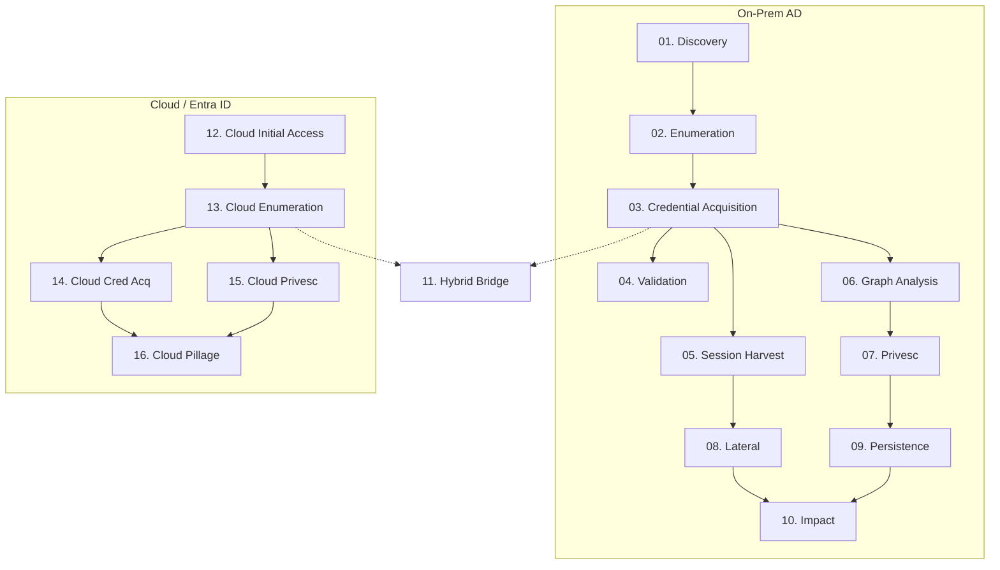

<p align="center">
  
</p>

<h3 align="center">Watch it find the network, steal the keys, break the trust, and own everything — automatically</h3>

<p align="center">
  <a href="LICENSE">
    
  </a>
  <a href="https://go.dev">
    
  </a>
  
    
</p>

<p align="center">
  <a href="#-quick-start"></a>
  <a href="#-features"></a>
  <a href="#-evasion-profiles"></a>
  <a href="#-documentation"></a>
  <a href="#-installation"></a>
</p>

<br>

> Authorised Use Only — This tool is for legitimate security assessments and penetration testing with explicit written authorisation. Unauthorised access to computer systems is illegal.

<br>

## Overview

AdPack runs Active Directory and cloud security assessments from a single pipeline. It takes a set of starting credentials and works through each phase, tracking what it finds and figuring out what to do next. Not a checklist — it keeps going until it gets everything it can.

The pipeline has three independent tracks:

- **On-prem AD (Phases 1–10):** Scans the network for domain controllers, queries LDAP to map users and groups, then goes after credentials — password sprays, Kerberoasting, LSASS dumps, NTDS.dit extractions. It tests every credential across SMB, LDAP, and WinRM to see what works, then hunts sessions, builds a BloodHound graph, and chases privilege escalation paths until it owns the domain. Once it has Domain Admin, it moves laterally across every machine, drops persistence, and pivots across forest trusts to compromise child and parent domains.

- **Cloud / Entra ID (Phases 12–16):** Runs independently against an Entra ID tenant — no on-prem required. Teams phishing, OAuth consent phishing, and device code auth for initial access, then tenant enumeration, password spraying, privilege escalation, and data pillaging from mail, SharePoint, and Teams.

- **Hybrid Bridge (Phase 11):** The only connection between the two tracks. If both on-prem and cloud access exist, it checks whether on-prem Domain Admins sync to Entra ID Global Admins, or whether cloud access can be used to pivot back to on-prem. It only activates when it has creds on both sides.

Every step is tracked in an encrypted SQLite database. Run `status` to see what it has found, `next` to see what it can try next, and `autorun` to chain everything together.

### Quick Start

```bash
git clone https://github.com/Yenn503/AdPack.git
cd adpack && ./setup.sh && source ~/.bashrc

# Automated attack chain — seed creds, execute privesc paths
adpack autorun --target 10.0.0.5 \
  --domain corp.local \
  --user jsmith --password 'Password1' \
  --execute --skip-fail
```

### Example Output

<p align="center">
  
</p>

### Manual Workflow

```bash
adpack status                          # View current state and gaps
adpack run discovery -t 10.0.0.5       # Find domain controllers
adpack run enumeration -t 10.0.0.5     # Enumerate users and computers
adpack run credential_acq -t 10.0.0.5  # Extract credentials
adpack validate                        # Test creds across protocols
adpack run lateral -t 10.0.0.6         # Lateral movement
```

See [USAGE.md](docs/USAGE.md) for the full command reference.

---

## Features

### Orchestration
- Tracks state across phases so you know what's been done and what's left
- `autorun` chains phases together, `--resume` picks up where you left off
- `--dry-run` previews actions before running them
- Scope enforcement via CIDR whitelist in config
- TUI dashboard via `adpack interactive`

### Credential Operations
- Credential dump: nanodump+pypykatz, falls back to nxc SAM/LSA
- AV kill after SYSTEM: native reg add + sc stop + taskkill (no external binary)
- Kerberoasting and AS-REP roasting with automatic hash capture
- Hash cracking via hashcat (NTLM, krb5tgs, krb5asrep)
- Multi-protocol validation: SMB, LDAP, WinRM, RDP
- Flags admin rights and lateral movement options

### Evasion
- 3 profiles: `native` (reg-based AV kill), `pplshade` (BYOVD PPL bypass), `phantomkiller` (EDR process kill)
- AV kill runs automatically after SYSTEM access
- Internal credential acquisition pipeline supports PPLShade, MiniPlasma, PhantomKiller as fallback stages
- See the [evasion profiles table](#evasion-profiles) below

### Transport
Commands run through nxc/impacket for SMB, WinRM, WMI, and MSSQL. Sliver C2 transport available for executing through implants (`internal/transport/sliver/`). Swap in custom transports for any C2.

### Cracking
Extracted hashes queue into background hashcat workers. Cracked creds land in the state database and trigger privesc re-evaluation.

---

## Attack Phases

16 ordered phases with dependency-grounded execution:



---

## Evasion Profiles

3 profiles for credential acquisition:

| Profile | What it does | When to use it |
|---------|-------------|----------------|
| `native` | reg add + sc stop + taskkill, then nanodump | Default — kills Defender, no extra binaries |
| `pplshade` | BYOVD PPL bypass via PPLShade + LECOMAx64.sys | LSASS is PPL-protected |
| `phantomkiller` | BYOVD process killer via PhantomKiller + PhantomKiller.sys | Need to kill EDR processes |

### Tool Provenance

| Tool | Source |
|------|--------|
| nanodump | Go binary, downloaded during setup |
| PPLShade | GitHub release (BYOVD) |
| PhantomKiller | GitHub release (BYOVD) |
| MiniPlasma | GitHub release — may require manual download |

### Pre-conditions

- **native** — Nothing extra needed. Runs reg + sc + taskkill after SYSTEM.
- **pplshade** — Needs `PPLShade.exe` + `LECOMAx64.sys` on target. Downloaded during setup.
- **phantomkiller** — Needs `PhantomKiller.exe` + `PhantomKiller.sys` on target. Downloaded during setup.

---

## Environment

Built on Windows + WSL2 (Ubuntu). Single Go binary — compile and drop on any Linux attack box. Windows tool binaries live in `exe/` alongside.

Tested on DreadGOAD-Light (3 VMware VMs, 2 forests) and VulnAD (Docker).

---

## Configuration

Create `adpack.yaml` in your project directory (or `~/.adpack/config.yaml`):

```yaml
domain: "corp.local"
profile: "native"

db_path: ""
nmap_args: ["-T4", "-sn"]
nxc_path: "netexec"
bh_python: "bloodhound-python"

seeds:
  - domain: "corp.local"
    user: "jsmith"
    password: "ChangeMe"

cracking:
  hashcat_path: "/usr/bin/hashcat"
  wordlist: "/usr/share/wordlists/rockyou.txt"
  rules: ["/usr/share/hashcat/rules/best64.rule"]
  timeout_seconds: 600

# Target scope: CIDR ranges allowed for attacks (optional safety net)
# scope:
#   - "10.0.0.0/8"
#   - "192.168.1.0/24"
```

Credentials are encrypted with AES-GCM in SQLite. The key file sits next to the database — keep both on an encrypted disk with 600 perms.

See [config.example.yaml](config.example.yaml) for the full reference.

---

## Installation

### Automated Setup

```bash
git clone https://github.com/Yenn503/AdPack.git
cd adpack
./setup.sh
source ~/.bashrc
```

Installs Go 1.25+, NetExec, pypykatz, nanodump, PPLShade, PhantomKiller, and the adpack binary. ~5-10 minutes.

### Manual Installation

See [docs/SETUP.md](docs/SETUP.md).

---

## All Commands (v0.6.0)

| Command | Description |
|---------|-------------|
| `adpack autorun` | Full automated attack chain |
| `adpack run <phase>` | Execute a single attack phase |
| `adpack status` | Current state and gaps |
| `adpack next` | Recommended next phase |
| `adpack interactive` | TUI dashboard |
| `adpack session save/load/list/delete/export/import` | Engagement session management |
| `adpack kerb tgt/list/destroy/s4u` | Kerberos ticket management |
| `adpack adcs find/esc1-esc13/auth` | ADCS exploitation |
| `adpack zerologon check/exploit/dcsync/restore` | CVE-2020-1472 exploit |
| `adpack nopac check/exploit/dcsync/scan` | CVE-2021-42278/42287 exploit |
| `adpack coerce printerbug/petitpotam/dfscoerce/shadow/all` | NTLM coercion |
| `adpack trust list/keys/inter-realm/sidhistory` | Domain trust attacks |
| `adpack shadow ntds/ifm/parse` | NTDS.dit extraction |
| `adpack gpo create/runkey/task/localadmin/find` | GPO abuse |
| `adpack dpapi backupkey/masterkey/blob/vault/chrome/triage/credentials` | DPAPI decryption |
| `adpack gmsa list/read` | gMSA account enumeration |
| `adpack laps list` | LAPS password enumeration |
| `adpack cred list/export/status/verify` | Credential inventory |
| `adpack report html/md/json` | Engagement reports |
| `adpack validate tools/config/setup` | Validation suite |
| `adpack bloodhound collect` | BloodHound collection |
| `adpack ingest` | Import tool output |
| `adpack query` | Cypher queries |
| `adpack initial teams/device-code/consent-phish` | Initial access (Teams/OAuth) |
| `adpack cloud enum/cred-acq/privesc/pillage` | Cloud/Entra ID attacks |
| `adpack phases/profiles/loot/reset` | Utility commands |
| `adpack query [--preset <name>] [--list-presets]` | Cypher queries with preset library |

## Documentation

| Doc | Description |
|-----|-------------|
| [USAGE.md](docs/USAGE.md) | Complete command reference, workflows, and examples |
| [SETUP.md](docs/SETUP.md) | Installation guide and environment setup |
| [CONTEXT.md](docs/CONTEXT.md) | Domain language, architecture, and design decisions |
| [CONTRIBUTING.md](docs/CONTRIBUTING.md) | Development guidelines and contribution process |
| [CHANGELOG.md](docs/CHANGELOG.md) | Release history |

---

## License

MIT License — see [LICENSE](LICENSE)

## Contributing

PRs welcome. Read [CONTRIBUTING.md](docs/CONTRIBUTING.md) first.
